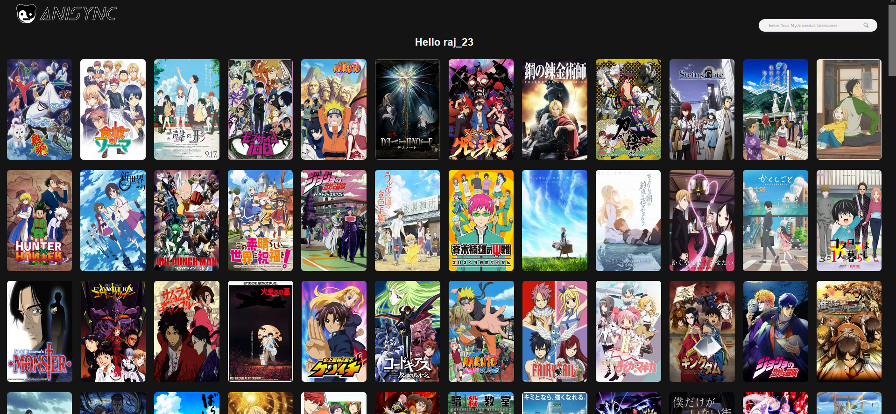

# Anisync - Convert your Anime List to Osu maps!

## Description

Have you ever had an issue of finding maps to play? well we are here to fix that by bridging the gap between anime and Osu! Anisync is a web application that takes a MyAnimeList (MAL) username as input and returns a list of songs from the popular game Osu! that appear on the user's anime list. As an Osu! player myself, I always found it difficult to find maps to play when it was so tedious to search an anime one by one. For those who don't know, osu! is a popular rhythm game that has a large community of players. The game has a large library of songs to choose from and is constantly growing. The game is free to play and can be downloaded [here](https://osu.ppy.sh/home/download).
The app has utilized the Osu! API, unofficial MyAnimeList API, and Beautiful Soup for data gathering. HTML, CSS, Javascript, and Jinja display the content in a clean and sophisticated way. The back end uses Flask with an SQLite3 database for faster processing and the full website is hosted on a Digital Ocean server (droplet).


## How to run the program

Currently, a website for this program is deployed with the latest version being avaliable at: https://anisync.live

The program can also be run locally by following these steps. Please ensure you have pip installed on your machine. If you do not, please follow the instructions [here](https://pip.pypa.io/en/stable/installing/).

1. Clone this repository to your local machine:

```bash
git clone https://github.com/RajPandya737/Anisync.git
```

2. Change to the project directory:

```bash
cd Anisync
```

3. The project utilizes many libraries. Ensure you have all of them downloaded by running

```bash
pip install -r requirements.txt
```

4. Run the program, please read the usage part of this file before continuing:

```bash
python Anisync/app.py
```

## Usage

On the website, simply type in your MAL username into the search bar and click submit. The program will then take a few seconds to process the data and return a list of beatmaps that appear on your anime list. The beatmaps are sorted by the rating you gave on your list, and the list is limited to 300 beatmaps. If you have typed in your username correctly and no maps appear, it is likely due to the theme you have enabled on your anime profile, please disable it and try again.

If you are running it locally, make your way to http://localhost:8000 and follow the same steps as above.

## Project Structure
The project consists of the following files inside of the Anisync Folder folder:

1. `app.py`: The main Python script.
2. `config.py`: Contains all constants used in the program.
3. `data_processing.py`: Stores all data retrival functions.
4. `db.py`: Runs any database related functions, used to add data to the database.
5. `static/css`: Contains CSS for each of the respective HTML files. The CSS is minified.
6. `static/images`: Contains all images used in the project.
7. `static/js/about.js`: Gives FAQ button functionality on about route.
8. `static/js/index.js`: Corrects anime name mistakes due to the data_processing.py script on view-maps route.
9. `static/js/scroll.js`: Sticky header functionality on view-maps route.
10. `templates`: Contains all HTML files used in the project.
11. `translated_anime_list.sqlite`: SQLite3 database that stores all anime data.
12. `wsgi.py`: Used for deployment on Digital Ocean.

## Design Process

### Getting MyAnimeList Data
Assuming the MAL account exists, the first step of the program is to get the user's anime list from MAL. Unfortunetly I was not able to find any API's that do this seemlessly and so I decided to use webscrapping instead. The link to every users anime list sorted from highest score to lowest score is ALWAYS the same, just a different query in the URL. With this information, a simple username can retrieve your list, however there are limitations. MAL loads the list data dynamically and so webscrapping only retrieves ~300 enteries leaving the rest to be unaccessable. This is why the program is limited to 300 beatmaps. 

### Storing Data
Cleaning the data with regex, we can obtain a list of anime names. Using an unofficial MAL API, we can retrieve the anime image URL which will be useful for displaing on the website. Calling this API takes around 2 seconds per anime and so it would not be efficient to rely on it alone. This is why I decided to use a SQLite3 database to store all the anime data. While an SQLite3 database may not be ideal for production, it is perfect for this project. SQLite3 databases are light weight and fast but have drawbacks when you reach hundreds of thousands of enteries. Luckily, this project will only store a few thousand enteries which a SQLite3 database can handle. As of right now, the database contains ~2500 enteries. MAL has around thirteen thousand rated anime, however, many of these are shows are unpopular, so I ensured to fill the database with as many of the popular shows as I can. 

### Getting Beatmaps 
Populating the database proved to be a bit challenging, primarily due to the edge cases. For example, when you add an anime with unicode such as Lucky☆Star, it saves it into the database as Lucky\u2606Star so we need to address these small issues. The next step is to get the beatmaps. This is done by using requests, I did try using the Osu! search with its API, however, the rate limit, and the inaccuracy of the searches made it much more challenging, so I decided to use Google searching instead. It takes the first result of searching "{anime name} osu beatmap" and scrapes the website using Beautiful Soup to determine if it is first of all a beatmap, and second of all, the artist and song name. This is done by using Beautiful Soup. 

### Web Development and Deployment
This is stored in the same row as the anime name and image URL. For the server side code, I used Flask, a lightweight python framework that has all the functionality I need, primarily session data, routing, rendering templates, sitemap data, 404 pages, and more. The front end is written in HTML, CSS, and Javascript. The CSS and JS is minified to provide a faster loading page. Once everything was connected, I created a Digital Ocean droplet running Ubuntu 20.04. The website is served using Nginx and Gunicorn which is the purpose of the wsgi.py file. The website is secured using Let's Encrypt and so it running through HTTPS.

## Future Development

I will try to maintain this site and add new features when possible, however, with school and other commitments, I cannot guarantee that I will be able to. If you have any suggestions, feel free to let me know. As of right now, a few features I would like to add are:
 - Anilist Support
 - Top Anime ranked by MAL and their maps
 - Sorting by categories other than user rating
 - Multiple maps per anime


## Credits

- **MyAnimeList API**: Currently used to get the anime image. [Github and Documentation](https://github.com/darenliang/mal-api)
- **Osu! API**: While I do not use this in the current state of the project, I initially did to aid in prototyping. [Github and Documentation](https://github.com/circleguard/ossapi)
- **MAL Accounts Used for Testing and Data Gathering**:
  - Personal Account:
    - [raj_23](https://myanimelist.net/profile/raj_23)
  - Friend Accounts:
    - [04Ace](https://myanimelist.net/profile/04Ace)
    - [MayilArna](https://myanimelist.net/profile/MayilArna)
    - [Kyoko_52](https://myanimelist.net/profile/Kyoko_52)
    - [cantstudy](https://myanimelist.net/profile/cantstudy)
  - Additional Accounts:
    - [NuxTaku](https://myanimelist.net/profile/NuxTaku)
    - [KingAbsalon21](https://myanimelist.net/profile/KingAbsalon21)
    - [ashuulinksu](https://myanimelist.net/profile/ashuulinksu)
    - [Joshhhp](https://myanimelist.net/profile/Joshhhp)
    - [sayu-simp](https://myanimelist.net/profile/sayu-simp)
    - [Lakdinu](https://myanimelist.net/profile/Lakdinu)
    - [Kineta](https://myanimelist.net/profile/Kineta)
    - [SenApai07](https://myanimelist.net/profile/SenApai07)
    - [SingleH](https://myanimelist.net/profile/SingleH)
    - [ThatAnimeSnobRE](https://myanimelist.net/profile/ThatAnimeSnobRE)
    - [Gsarthotegga](https://myanimelist.net/profile/Gsarthotegga)
- **Netflix**: Much of the UI is inspired by Netflix's login page. [Netflix Website](https://www.netflix.com/)


## License
This project is licensed under the [GNU Affero General Public License v3.0](LICENSE).
